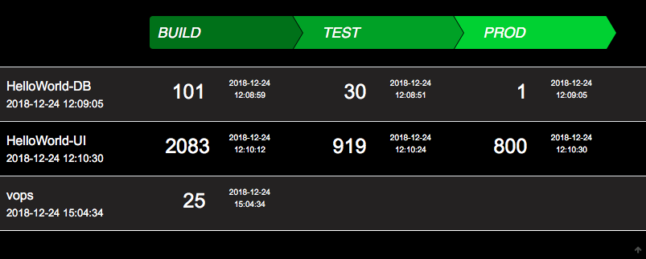

# VOPS

VersionOPS - View build or deployinformation from a Database to a UI.
Gives a REST-API for posting data.


### Composition with docker
```
vops:
  image: dockermgeo/vops:latest
  ports:
    - "27080:3200"
  environment:
    - MONGODB_HOST={MONGODB_HOST}
```

### Environment
##### Needed
- MONGODB_HOST=**{MONGODB_HOST}**

##### Optional
- LOG_LEVEL=**{INFO|DEBUG|ERROR}**
- MONGODB_PORT=**{MONGODB_PORT}**
- MONGODB_USER=**{MONGODB_USER}**
- MONGODB_PASSWORD=**{MONGODB_PASSWORD}**


### API
#### Get a list of versions
- http://**{HOST}**:<27080>/api

#### Store a version
- http://**{HOST}**:<27080>/api/add/**{NAMESPACE}**/**{APPNAME}**/**{STAGE}**/**{VERSION}**

### Jenkins-LIB

#### reportVersion.groovy
```
def call() {
    sh '''
        curl -s http://${VOPS_HOST}:${VOPS_HOST:-27080}/api/add/${NAMESPACE}/${DOCKER_IMAGE}/${REPORT_STAGE}/${BUILD_NUMBER}
    '''
}
```
#### Controll with Jenkinsfile
```
environment {
  def REPORT_STAGE='build'
}
...
stage('DEPLOY_TEST') {
  environment {
    def REPORT_STAGE='test'
  }
  steps {
    reportVersion()
  }
}
```

## APP-Screenshot

