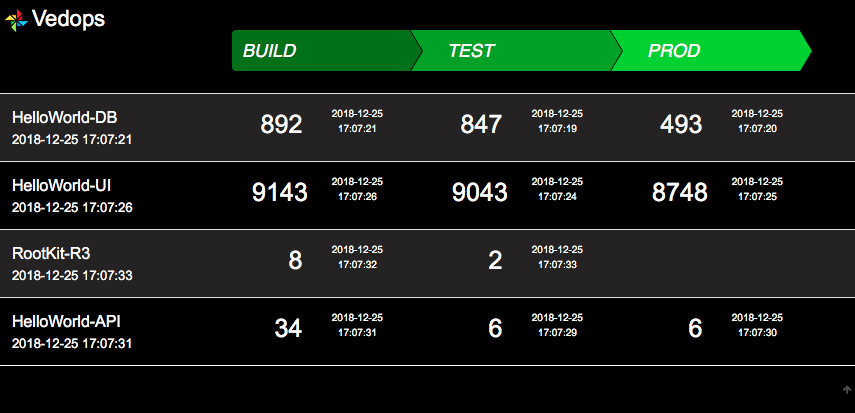

#  Vedops


- build: v1.52 - updated: 2018-12-25T18:21:24+0000
---


Vedops, or with other words: **Versioning DevOps**. This app serve a API to commit version of build- or deployinformation to a mongodb-Databasesystem in the backend.

The Frontend gives you a overview about your build/deployments etc. The UI support untils to 5 stages.


A Screenshot of the Frontend will printed at the bottom of this document.

## Docker
Dockerimage is available on [Dockerhub-dockermgeo-vedops](https://hub.docker.com/r/dockermgeo/vedops).

##### Composition for docker
```
vedops:
  image: dockermgeo/vedops:latest
  ports:
    - "27080:3200"
  environment:
    - MONGODB_HOST={MONGODB_HOST}
mongo:
  image: mongo
  ports:
    - "27017:27017"
  environment:
    - MONGODB_ROOT_PASSWORD=password123
```

## Environment

##### Needed
  - MONGODB_HOST=**{MONGODB_HOST}**

##### Optional
  - LOG_LEVEL=**{INFO|DEBUG|ERROR}**
  - LIST_STAGES=**{'ST1 ST2 ST3 ST4 ST5'}**
  - MONGODB_PORT=**{MONGODB_PORT}**
  - MONGODB_USER=**{MONGODB_USER}**
  - MONGODB_PASSWORD=**{MONGODB_PASSWORD}**


## API
#### Get All from Store
- *GET* http://**{HOST}**:<27080>/api

#### Add to Store
##### PUT or UPDATE
- *POST* http://**{HOST}**:<27080>/api/add/**{NAMESPACE}**/**{APPNAME}**/**{STAGE}**/**{VERSION}**

#### Delete from Store

##### Delete a Application over all stages
- *POST* http://**{HOST}**:<27080>/api/delete/app/**{APPNAME}**

#### Delete a Version
- *POST* http://**{HOST}**:<27080>/api/delete/version/**{APPNAME}**/**{STAGE}**


### Jenkins-LIB

#### reportVersion.groovy
```
def call() {
    sh '''
        curl -s -X POST http://mecy:27080/api/add/namespace/${DOCKER_IMAGE}/${REPORT_STAGE}/${BUILD_NUMBER}
    '''
}
```
#### Controll with Jenkinsfile
```
environment {
  def REPORT_STAGE='build'
}
...
stage('DEPLOY_TEST') {
  environment {
    def REPORT_STAGE='test'
  }
  steps {
    reportVersion()
  }
}
```

## APP-Screenshot

---



---
